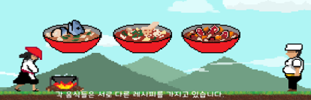
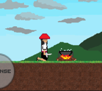
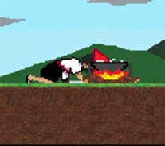
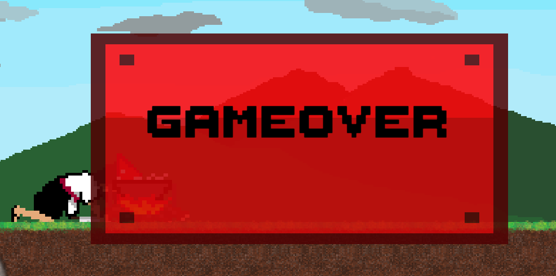

# 고기 싸무라이 (Gogi Samurai)

## 게임 개요
- 타이틀: 고기 싸무라이
- 장르: 2D 아케이드 게임
- 플랫폼: 모바일 (구글 플레이스토어)

## 게임 소개
### 배경
- 오래 즐길 수 있는 반복적이고 중독성 있는 게임
- 누구나 쉽게 즐길 수 있는 간편한 조작감 (모바일 게임)
- 언제 어디서나 간편하게 플레이 가능한 게임성

### 스토리
주인공은 최고의 미식가로부터 최악의 평가를 받은 뒤, 10년 동안 산속에서 요리 훈련을 하게 된다. 10년 후 마을로 돌아오던 중 우연히 미식가를 만나게 되고, 미식가의 도발에 그동안 갈고 닦은 실력을 내기로 한다.

### 메인화면

- 3가지 음식 레시피를 가지고 있음

- 목표: 최대한 많은 레시피(요리)를 완성하여 높은 점수 획득

- 레시피보다 더 많거나 다른 재료를 넣으면 게임 오버
    
- 미식가(NPC)가 던지는 재료들을 식칼로 베어 냄비에 넣거나, 원하지 않는 재료는 후라이팬으로 쳐낸다.
- 날라오는 재료들을 타이밍에 맞춰 한 번에 베어 냄비에 넣는다.
- 이중 공격도 가능하여 간격이 좁은 재료들도 벨 수 있다.
- 한 레시피가 완료되면 랜덤의 다른 레시피로 초기화되어 게임을 속행한다.
- 음식이 나오는 것은 음악의 박자에 맞춰서 나온다.
- 게임 씬에서 배경음악과 효과음을 조절할 수 있다.
- 배경 음악이 끝나면 랜덤으로 다음 음악이 재생된다.
- 레시피를 완성할 때마다 300점씩 점수가 올라간다.